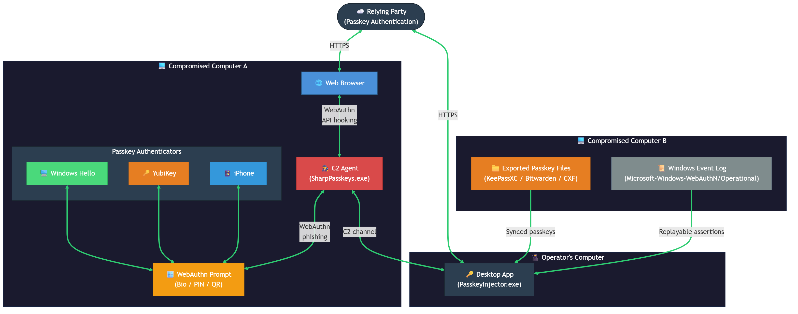
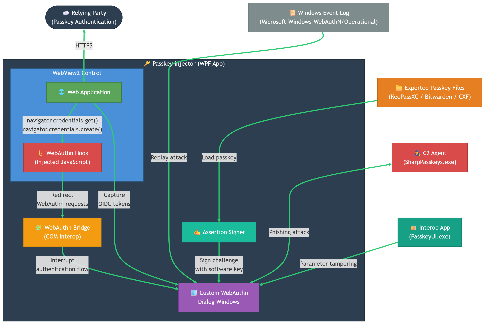
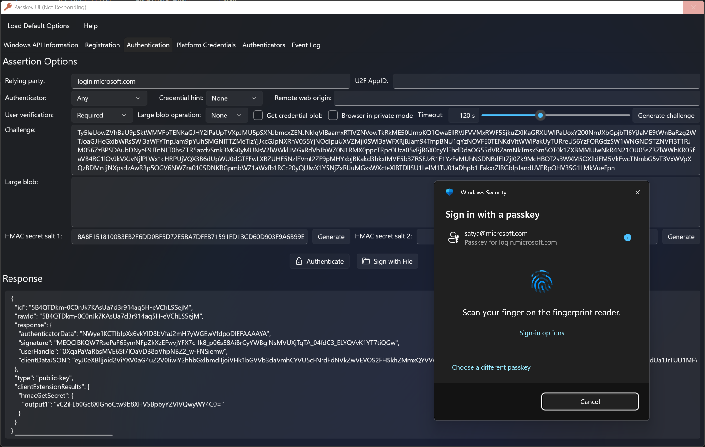
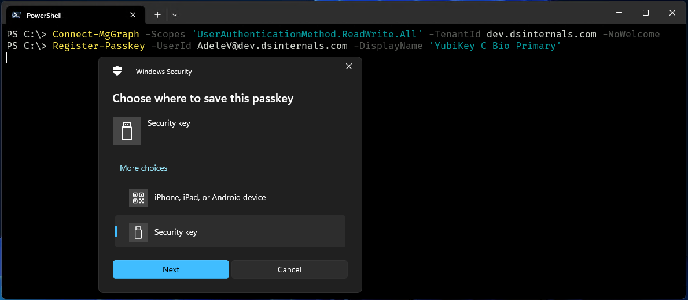

# Pass-the-Passkey Family of Attacks

This repository contains a collection of tools and resources related to the Pass-the-Passkey family of attacks,
which target WebAuthn and FIDO2 authentication mechanisms in Windows
and were featured in the [Black Hat USA 2026 talk](https://blackhat.com/us-26/briefings/schedule/?#pass-the-passkey-family-of-attacks-51821).
These tools are designed for security researchers and penetration testers to assess the security of systems that use passkey-based authentication.

> [!WARNING]
> The techniques described in this repository are intended for educational purposes only.
> Unauthorized use of these procedures may violate laws and regulations.

## Tools

### Passkey Injector

The Passkey Injector is a simple web browser built on the Edge WebView2 control
that intercepts WebAuthn assertion requests and allows responses to be injected in JSON format.

There are multiple use cases for tampering with the passkey authentication flow, including:

- Replay of captured assertions from network traffic, API hooks, or browser logs.
- Phishing attacks by forwarding attacker-controlled assertions.
- Injection of modified assertions to test server-side validation.
- Signing challenges using stolen synchronized passkeys, e.g., from KeePassXC or Bitwarden.
- Analysis of WebAuthn features and extensions used by a particular cloud service.
- Learning how the WebAuthn protocol works.

### SharpPasskeys Tool

This tool is a .NET Framework 4.8 assembly designed to be executed as a payload
by a Windows C2 agent like [Apollo](https://docs.specterops.io/mythic-agents/apollo-docs/documentation-payload/apollo), part of the [Mythic](https://mythic-c2.net/) C2 framework.

The main purpose of this payload is to display a passkey authentication prompt to the user
and retrieve the resulting assertion. It can also list available Windows Hello credentials
and monitor the Windows Event Log for new WebAuthn authentication events.

See the [SharpPasskeys documentation](Documentation/SharpPasskeys.md) for more information.

### WebAuthn Hook

The WebAuthn Hook is a native DLL that SharpPasskeys can inject into browser processes.
It uses Microsoft Detours to intercept the [`WebAuthNAuthenticatorGetAssertion`](https://learn.microsoft.com/en-us/windows/win32/api/webauthn/nf-webauthn-webauthnauthenticatorgetassertion) Win32 API call,
allowing operators to observe and tamper with the WebAuthn assertion workflow.

The hook communicates with the SharpPasskeys process over the `\\.\pipe\WebAuthnHook` named pipe.
Through this control channel, SharpPasskeys can monitor assertion requests and responses, capture the
resulting `PublicKeyCredential`, inject a replacement `challenge`, or withhold
a successful assertion from the browser.

See the [WebAuthn Hook documentation](Documentation/WebAuthnHook.md) for more information.

### DSInternals Passkey UI

`Passkey UI` is a simple Windows application that provides a graphical user interface for interacting with the Windows WebAuthn API. The source code of this tool is hosted in the [webauthn-interop](https://github.com/MichaelGrafnetter/webauthn-interop) repository.

### DSInternals.Passkeys PowerShell Module

The [DSInternals.Passkeys](https://www.powershellgallery.com/packages/DSInternals.Passkeys) PowerShell module lets Microsoft Entra ID and Okta administrators register passkeys on behalf of other users. The source code of this module is hosted in the [webauthn-interop](https://github.com/MichaelGrafnetter/webauthn-interop) repository.

### Beacon Object File (BOF)

We have decided not to publish our BOF implementation of SharpPasskeys yet.

## Related Tools

### Passkey Raider

[Passkey Raider](https://github.com/portswigger/passkey-raider) is a Burp Suite extension for testing and manipulating passkey authentication flows.

### passkeys.tools

[passkeys.tools](https://github.com/RUB-NDS/passkeys.tools) is an analysis and debugging platform for passkey implementations, developed at Ruhr University Bochum.

### Entra ID Synced Passkey Login

Fabian Bader's [Invoke-EntraIDPasskeyLogin.ps1](https://github.com/f-bader/TokenTacticsV2/blob/main/modules/Invoke-EntraIDPasskeyLogin.ps1), part of the [TokenTacticsV2](https://github.com/f-bader/TokenTacticsV2) toolkit, performs a non-interactive Entra ID sign-in using a WebAuthn private key extracted from a synced vault (Bitwarden, 1Password, KeePassXC) and returns OAuth tokens usable against Microsoft Graph. A modified variant, [Invoke-EntraPasskeyInjection.ps1](Src/Scripts/Invoke-EntraPasskeyInjection.ps1), is included in this repository and accepts a precomputed `PublicKeyCredential` payload so it can be chained with assertions from the **Passkey Injector** and **SharpPasskeys** tools.

## Author

### Michael Grafnetter

