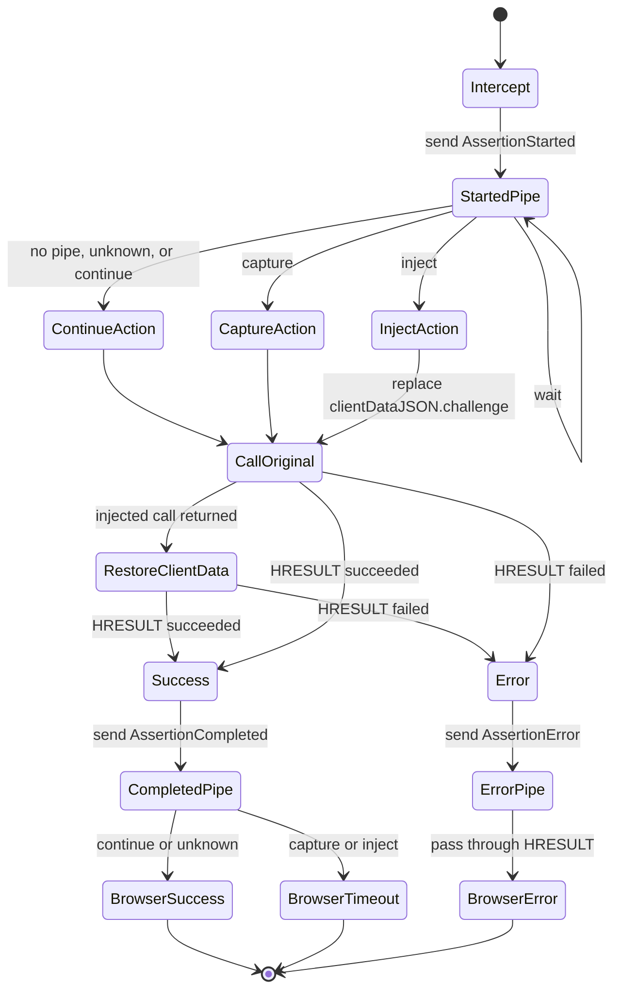

# WebAuthn Hook

## Overview

The WebAuthn hook functionality is split across two projects:

| Project | Role |
| ------- | ---- |
| `SpecterOps.Passkeys.WebAuthnHook` | Native DLL that is injected into a browser process and hooks the [`WebAuthNAuthenticatorGetAssertion`](https://learn.microsoft.com/en-us/windows/win32/api/webauthn/nf-webauthn-webauthnauthenticatorgetassertion) WebAuthn assertion call with Microsoft Detours. |
| `SpecterOps.Passkeys.SharpPasskeys` | Managed host that finds browser processes, injects or unloads the hook DLL, and hosts the `\\.\pipe\WebAuthnHook` control pipe. |

The hook targets browser processes that use the Windows WebAuthn client library (`webauthn.dll`). Its primary detour intercepts
`WebAuthNAuthenticatorGetAssertion`, which is the Windows API used to start a passkey assertion ceremony. The detour can:

- observe the relying party ID and client data before the authenticator prompt is shown;
- optionally replace the `clientDataJSON.challenge` value before the request reaches Windows;
- capture successful assertions in the [`PublicKeyCredential`](https://developer.mozilla.org/en-US/docs/Web/API/PublicKeyCredential) JSON format;
- optionally withhold successful assertions from the browser by returning a timeout error.

The managed injector resolves a same-architecture DLL named `WebAuthnHook_x64.dll`, `WebAuthnHook_x86.dll`, or
`WebAuthnHook_arm64.dll` unless an explicit path is provided by its caller.
Target selection is intentionally browser-focused. The default browser resolver searches `msedge`, `chrome`, `firefox`,
`brave`, `opera`, and `vivaldi`. For each browser name it prefers processes with a visible top-level window, then processes
that have already loaded `webauthn.dll`, then all remaining matching processes.

## Named Pipe

The hook DLL and managed host communicate over a local message-mode named pipe:

```txt
\\.\pipe\WebAuthnHook
```

The managed `hook wait` command uses that name by default, but its server-side listener can be pointed at another local pipe name with `--named-pipe`, `--pipe`, or `-p`.

The managed host is the pipe server. The hook DLL is the pipe client and uses [`CallNamedPipeW`](https://learn.microsoft.com/en-us/windows/win32/api/namedpipeapi/nf-namedpipeapi-callnamedpipew) for each message, so every hook-to-server
message is a separate connection. The server reads one complete message, writes one optional action response, disconnects, and
then waits for the next connection.

Pipe details:

| Setting | Value |
| ------- | ----- |
| Direction | Duplex (`PipeDirection.InOut`) |
| Transmission mode | Message |
| Hook-to-server buffer | 10 KiB |
| Server-to-hook buffer | 5 KiB |
| Initial hook response timeout | 1 second |
| Response timeout after `wait` | 60 seconds |
| Server security | Denies `NETWORK LOGON`; allows `Authenticated Users` read/write |

If the pipe server is not running, the hook continues the intercepted
WebAuthn call using the original browser-supplied data.

### Hook-to-Server Messages

All hook messages are UTF-8 JSON and share these fields:

| Field | Description |
| ----- | ----------- |
| `type` | Polymorphic discriminator. One of `AssertionStarted`, `AssertionCompleted`, or `AssertionError`. |
| `timestamp` | UTC ISO 8601 timestamp generated by the hook. |
| `pid` | Browser process ID. |
| `processName` | Browser image name without `.exe`. |
| `userName` | Windows user name for the browser process. |
| `rpId` | Relying party ID passed to `WebAuthNAuthenticatorGetAssertion`. |
| `previousAction` | Optional action previously returned by the server for this ceremony. |

`AssertionStarted` is sent before the hook calls the real WebAuthn API:

```json
{
  "type": "AssertionStarted",
  "timestamp": "2026-04-25T10:18:30.224Z",
  "pid": 1234,
  "processName": "msedge",
  "userName": "alice",
  "rpId": "login.microsoft.com"
}
```

`AssertionCompleted` is sent after a successful WebAuthn API call. `payload` is serialized as browser-style
`PublicKeyCredential` JSON. Binary values are base64url encoded without padding.

```json
{
  "type": "AssertionCompleted",
  "timestamp": "2026-04-25T10:18:35.501Z",
  "pid": 1234,
  "processName": "msedge",
  "userName": "alice@contoso.com",
  "previousAction": "capture",
  "rpId": "login.microsoft.com",
  "payload": {
    "id": "Acrl0njmA0m3bZBHTOopzJYdv1IdQ5Hf4fKukd1xJrY",
    "rawId": "Acrl0njmA0m3bZBHTOopzJYdv1IdQ5Hf4fKukd1xJrY",
    "type": "public-key",
    "response": {
      "clientDataJSON": "eyJ0eXBlIjoid2ViYXV0aG4uZ2V0IiwiY2hhbGxlbmdlIjoiY2hhbGxlbmdlLWZyb20tc2VydmVyIiwib3JpZ2luIjoiaHR0cHM6Ly9sb2dpbi5taWNyb3NvZnQuY29tIiwiY3Jvc3NPcmlnaW4iOmZhbHNlfQ",
      "authenticatorData": "SZYN5YgOjGh0NBcPZHZgW4_krrmihTa3gmgkbS4Et7kFAAAAAQ",
      "signature": "MEUCIQDK1vY5KFCxJWNhcWZn4sFmkKWwK_mU2FDpY3o6CzJqfAIgFNAot4rXPt4hflnpiur42id1QxbXp7pL6Z2xbmXEfGM",
      "userHandle": "MDEyMzQ1Njc4OQ"
    },
    "clientExtensionResults": {}
  }
}
```

`AssertionError` is sent when the WebAuthn API returns a failure `HRESULT`:

```json
{
  "type": "AssertionError",
  "timestamp": "2026-04-25T10:18:35.501Z",
  "pid": 1234,
  "processName": "msedge",
  "userName": "alice@contoso",
  "previousAction": "continue",
  "rpId": "login.microsoft.com",
  "hresult": 2147943623
}
```

### Server-to-Hook Actions

The server replies to `AssertionStarted` with a `HookActionMessage`:

| Action | JSON | Hook behavior |
| ------ | ---- | ------------- |
| Continue | `{"action":"continue"}` | Call the original API with the browser-supplied request and return the real result to the browser. |
| Capture | `{"action":"capture"}` | Call the original API unchanged, send the successful assertion to the pipe, and return `ERROR_TIMEOUT` to the browser. |
| Inject | `{"action":"inject","challenge":"..."}` | Replace `clientDataJSON.challenge`, call the original API, send the successful assertion to the pipe, and return `ERROR_TIMEOUT` to the browser. |
| Wait | `{"action":"wait"}` | Ask the hook to send another `AssertionStarted` message and wait longer for a final action. This allows the operator to inject their own challenge. |

Following is a sample `inject` message:

```json
{
  "action": "inject",
  "challenge": "Y2hhbGxlbmdlLWZyb20tc2VydmVy"
}
```

## Hooking Mechanism

### Injection and Unloading

The native library is injected with the standard remote `LoadLibraryW` pattern:

1. Open the target process.
2. Allocate memory in the target with `VirtualAllocEx`.
3. Write the absolute hook DLL path into the target with `WriteProcessMemory`.
4. Start a remote thread at `kernel32!LoadLibraryW` with the remote path buffer.
5. Wait for the remote thread and treat a zero return value as injection failure.
6. Release the remote buffer with `VirtualFreeEx`.

Unload uses remote `FreeLibrary` against the loaded `WebAuthnHook_*.dll` module. It retries up to eight times because a process may
hold multiple loader references after detour setup.

The managed injector detects target process architecture with `IsWow64Process2` and chooses the corresponding hook DLL. An
explicit DLL path bypasses this name resolution, but it still has to match the target process architecture.

### Native Detours

`DllMain` initializes the hooks using the [Detours](https://www.microsoft.com/en-us/research/project/detours/) library when the DLL is loaded:

| API | Purpose |
| --- | ------- |
| `WebAuthNAuthenticatorGetAssertion` | Intercept passkey assertion requests. |
| `LoadLibraryW` | Bootstrap the assertion hook when `webauthn.dll` is loaded later. |
| `LoadLibraryExW` | Same as `LoadLibraryW`, for callers that use the extended loader API. |

### State Diagram



## Development Notes

- The hook observes assertion ceremonies only. It does not intercept passkey registration.
- The hook only sees callers that go through Windows `webauthn.dll`; browser or authenticator code paths that bypass that API
  are out of scope.
- The native JSON parser is deliberately small. It is used for server action messages and challenge replacement, not for general
  JSON processing.
